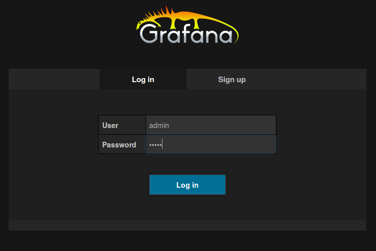
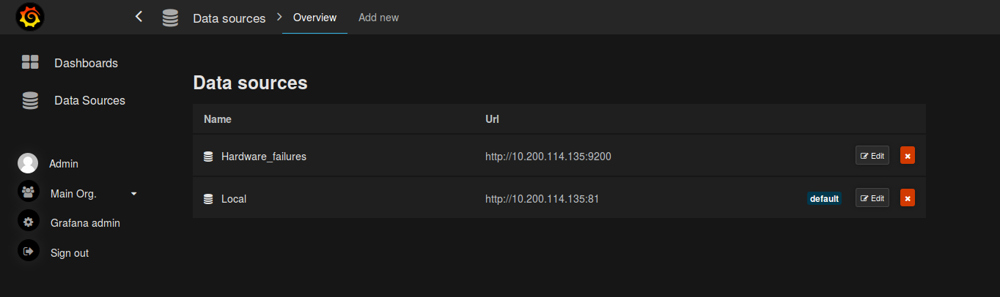
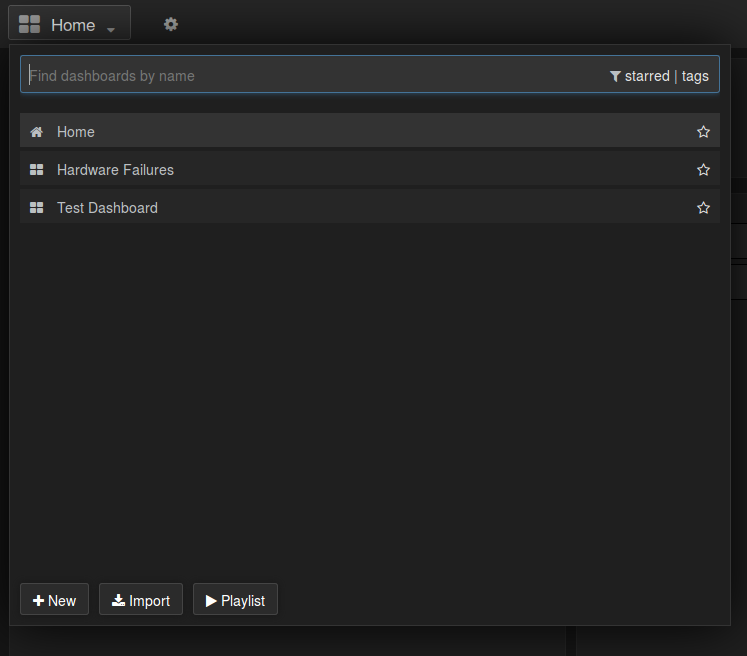
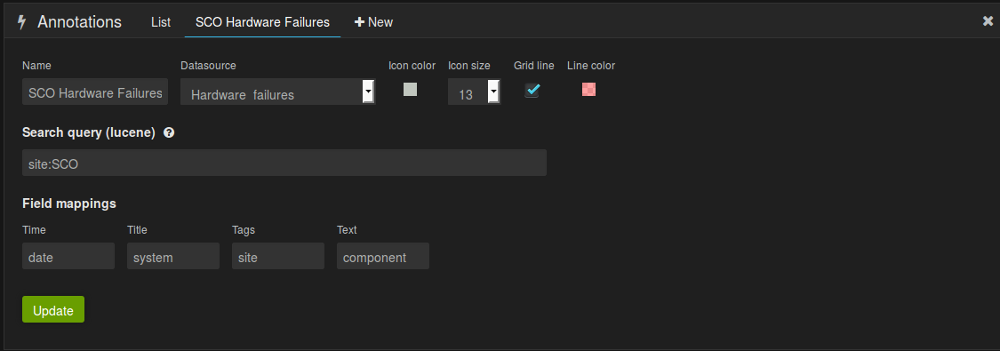

# Data Flow


The performance data is extracted by Nagios and then is written down in a file, Graphios takes that file and send the data to a collector service, in our case is Carbon, the data is aggregated (Average, Max, Min, or other function to tranform an array of points in an time interval to only one point) and then sended to a backend, for Graphite is Whisper, but it can be other time series database or a service as Librato. After the data is stored, Grafana uses it to create the different panels and Dashboards.

(Recommended video: https://www.youtube.com/watch?v=HRcwoBe3F6k)

# What is [Graphite](http://graphite.readthedocs.org/en/latest/)?
Graphite is a system to store time series data, composed for three elements:
* Carbon: Is the demon responsible for reciving metrics over the network, aggregate and store them in a storage backend.
* Whisper: Is a file-based time-series database, the default database for Graphite. Has a fixed-size (depending on the configuration), the more coarse the data, the less space used. This Database only accept numerical values.
* Graphite-web: Graphite default front-end, used to explore the data, and has an http api to retrieve data.

Other time series database compatible with Carbon is [Influxdb](https://influxdata.com/time-series-platform/influxdb/), that has his own SQL-like query language.


## Installing Graphite

GUIDE: http://centoshowtos.org/monitoring/graphite
### Installing carbon and whisper
```
yum install python-carbon python-whisper
```

* Configure /opt/graphite/conf/storage-schemas.cfg to give each metric a retention time.
  * You can use regular expressions to specify what databases or metric is going to have that retention schema. For legibility is better to use frequency:history to declare a retencion, for example: Get metrics every 5 minutes and store them for 7 days will be 5m:7d, and carbon will wait 5 minutes make an average (it can be changed) of all the points that recive and then store the average of that time for 7 days. 
  * For more information read the [documentation](http://graphite.readthedocs.org/en/latest/config-carbon.html#storage-schemas-conf).

  (If a retention time schema is created after the schema you need to run whisper-resize.py)

* Starting Carbon Demon
```
/etc/init.d/carbon-cache start
```
Carbon runs in port 2004.
* Installing graphite-web prerequisites
```
yum install graphite-web graphite-web-selinux 'django==1.7'
```
(django 1.9 and 1.8 not supported use django 1.7)
(Default config_dir is /etc/graphite-web)

* Optional: Configure production database for graphite-web

* Create graphite-web database
/usr/lib/python2.6/site-packages/graphite/manage.py syncdb

* For sqlite, dont change local_setting and run 
```
su -s /bin/sh apache -c "/usr/lib/python2.6/site-packages/graphite/manage.py syncdb"
```
or change the ownership of the sqlite database created by graphite-web.

* graphite-web comes with a default Apache Virtualhost file (/etc/httpd/conf.d/graphite-web.conf), I changed the port to 81 and add Listen 81 to Apache config file (/etc/httpd/conf/http.conf) to run it in a different port than Grafana.

* Restart Apache
/etc/init.d/httpd restart

# How do we send performance data from Nagios to Graphite. 
The solution is [Graphios](https://github.com/shawn-sterling/graphios), a small service that takes performance data from nagios, and send in bulks to the Carbon demon. 
## Installing Graphios

GUIDE: https://github.com/shawn-sterling/graphios

* Installed using pip.
* Installation add default configuration in nagios.cfg and add the commands to cfg_dir.
* Edit /etc/graphios/graphios.cfg if needed, to change carbon url or port.
  * Change enable_carbon to True.
  * Create graphite folder from /var/spool/nagios/graphite to /usr/local/nagios/var/spool folder and give the nagios user and group ownership (ls -l).
  * Set log_level = logging.INFO, if graphios is not working properly change to debug. Or set the test_mode option to true, and graphios will mantain the files in spool folder, and not delete after sending them to the carbon demon. 

* Add [Nagios Config](https://github.com/shawn-sterling/graphios#2-nagioscfg) to nagios.cfg file.
* Change the /var/spool/nagios/graphite to /usr/local/nagios/var/spool/graphite in nagios.cfg and graphios_commands.cfg.
* To configure the data sending graphios has two options:
  * Send all the services data:
      * Set use_service_desc to true.
      * The data will be sended in host.service.metric format to carbon.
      * Pros:
        * Easy to configure for small enviroments
      * Cons:
        * Send a lot of performance data that will not be used.

  * Configure each service to have a _graphiteprefix _graphitepostfix field. 
    * Look at the examples: [Simple Example](https://github.com/shawn-sterling/graphios#simple-example) , [Another Example](https://github.com/shawn-sterling/graphios#another-example).
    * It will only send the performance data from the service that have at least one of this fields.
    * The data will be sended in _graphiteprefix.hostname.service-description._graphitepostfix.perfdata format.
    * Pros:
      * Send only the important data
    * Cons:
      * Have to configure each service manually.

# Visualizing Performance Data
To visualize time series we will use [Grafana](http://grafana.org/) that allows us, to create fully customizable dashboards with data from Graphite, InfluxDB or Elasticsearch.

## Installing Grafana
GUIDE: http://docs.grafana.org/installation/rpm/
* Installed using
```
 yum install https://grafanarel.s3.amazonaws.com/builds/grafana-2.6.0-1.x86_64.rpm
 ```
This will create an sqlite database, if you need to change it you can do it in /etc/grafana/grafana.ini configuration file.
* Change grafana db owner to apache if needed (/var/lib/grafana/grafana.db)
* Enable grafana-server start on boot
 chkconfig grafana-server on
 (systemctl enable grafana-server.service)
* Start Grafana
 service grafana-server start
* The default port of grafana is 3000, to use it in other port, go to /etc/grafana/grafana.ini and uncomment the lines 
protocol = http, http_port = 80, and if you want to run in a diferent path add it to root_url.
* Is compatible with ldap, google and github authentications. (for default, grafana will show the github user image, if the grafana user has the same email).

## Using Grafana.
After the installation and configuration go to your root_url (default = localhost:3000) and login to grafana with user and password 'admin'.



To start making a dashbord, first we have to add a [Data Source](http://docs.grafana.org/datasources/overview/).




Click Add New, and then for a Graphite data source, use the grapite-web url. Then test the connection and save the data source.

To create a new dashboard, go to the Home dropdown and select new. (Also you can create dashboard playlist, and automatically change the dashboard showing every a fixed amount of time).



The two main components of a Dashboard are Rows and Panels, each row is divided in 12 spaces, each panel uses at least 1 space or can use the full width of the Row.

To add a new panel select a panel in the Green rectable at the left side of a Row.

Grafana has 3 panels that use metrics:
* [Graph](http://docs.grafana.org/reference/graph/):
  Important configurations for this panel:
  * In Axes & Grid, select the units of each metric. If you want to have series with different units (For example: Cpu use in % and Memmory in Mb), Click the color of the serie and select left or right.
  * In Display Style, we have the chart options.
  * Time range is used to set the time range of the graph.
* [Singlestat](http://docs.grafana.org/reference/singlestat/)
  Used to show only one value. Important configurations:
  * Value: Select the aggregation showed in the panel, select current for the last value recived.
  * Prefix and Postfix, can be used to show information about the value (Units, Names or Other info).
  * Coloring and Value to text mapping, can be used to give format to the value, for example change a binary value to a Up or Down Status.
  * Sparklines show a small graph of the value in time.
* [Table Panel](http://docs.grafana.org/reference/table_panel/)
  * Can be used to show the series in a table, or make a summary of metrics aggregations.

## Other Features:

### Time intervals
 Select time intervals in line graphs (zoom in) to get better resolution (depends on the data retentions schemas). Zoom out to go back. Has an autorefresh option, to reload the dashboard panels.

### Adding Annotations
Grafana uses annotations as important events in panels, annotations are added from a datasource, for example in Elasticsearch, create a query using [Lucene Query Syntax](http://www.lucenetutorial.com/lucene-query-syntax.html), and fill the Time field with the timestamp used in the Elasticsearch Document. The other fields are used to show the data.



In the image above, the query searches all the documents where the site is 'SCO'.

The other datasources uses another query syntax.

### Sharing panels to other webpages
To put a panel from Grafana in other web pages, select a panel, go to share and select an option, for a static image, go to link and use the 'Direct link rendered image', for a dynamic graph, go to embed and copy the iframe (change the width and height to fit your webpage).

### Grafana + Ganglia
To visualize data from Ganglia to Grafana, we have to pass the data to graphite, one idea is using [this guide](https://github.com/ganglia/monitor-core/wiki/Ganglia-Graphite) (Not Tested).
